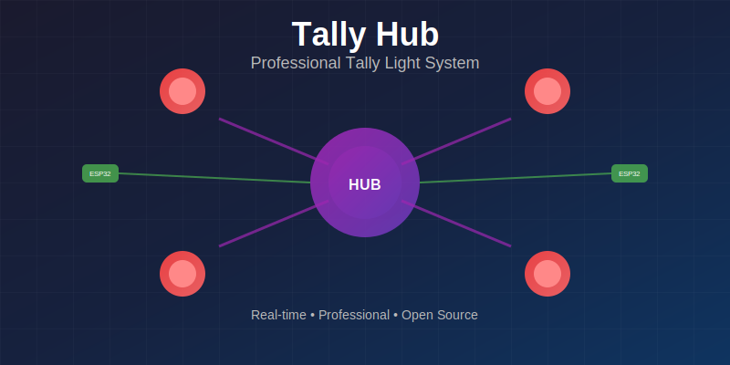
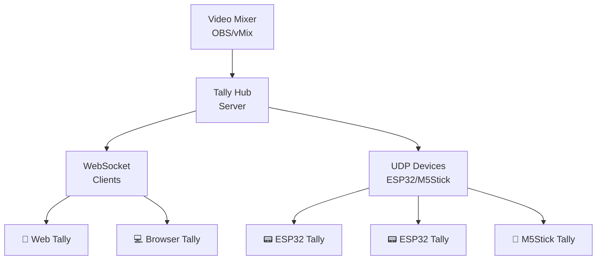

<div align="center">

# 📺 Tally Hub

**Professional Tally Light System for Video Production**



[](https://github.com/tallyhubpro/Tallyhub/releases)
[](https://tallyhubpro.github.io/Tallyhub)
[](LICENSE)
[](https://discord.gg/tallyhub)

*Transform your video production with professional tally lights at a fraction of traditional costs*

**[📖 Documentation](https://tallyhubpro.github.io/Tallyhub)** | **[⬇️ Download](https://tallyhubpro.github.io/Tallyhub/download/)** | **[🚀 Quick Start](https://tallyhubpro.github.io/Tallyhub/getting-started/)**

</div>

## 🎯 Why Tally Hub?

Tally Hub bridges the gap between expensive commercial tally systems and DIY solutions, offering professional-grade reliability with modern web technologies.

- **💰 Cost Effective**: $15-30 per device vs $200-500+ for commercial systems
- **🚀 Professional Grade**: Sub-100ms latency with enterprise-level reliability  
- **🎨 Modern Interface**: Beautiful gradient-based admin panel with real-time monitoring
- **🔌 Universal Compatibility**: Works with OBS Studio, vMix, and any computer
- **📱 Device Flexibility**: ESP32, M5Stick, or any web browser as tally lights

## ✨ Key Features

<div align="center">

| 🎥 **Video Mixer Support** | 📱 **Device Options** | 🌐 **Modern Web Tech** |
|---|---|---|
| OBS Studio ✅ | ESP32-1732S019 (~$15) | Real-time WebSocket |
| vMix ✅ | M5Stick C Plus (~$25) | Browser-based setup |
| ATEM (coming soon) | Web browsers (free) | TypeScript codebase |
| Custom API ✅ | Custom hardware ✅ | Responsive design |

</div>

## 🚀 Quick Start

### 1. Install Tally Hub

**Windows** | **macOS** | **Linux**
```bash
# Download from releases page
# Extract and run startup script
Start Tally Hub.bat        # Windows
./Start\ Tally\ Hub.command # macOS/Linux
```

### 2. Access Admin Panel
Open http://localhost:3000/admin.html in your browser

### 3. Connect Your Video Mixer
- **OBS Studio**: Enable WebSocket (Tools → WebSocket Server Settings)
- **vMix**: Enable Web Controller (Settings → Web Controller)

### 4. Add Tally Devices
- **Web Tallies**: Open http://[your-ip]:3000/tally.html on any device
- **Hardware**: Flash ESP32/M5Stick firmware using built-in web flasher

**🎬 You're ready to go!** Tally lights will respond in real-time to your video mixer.

## 📸 Screenshots

<div align="center">

### Admin Panel


*Modern web interface with real-time device monitoring and drag-and-drop source assignment*

</div>

## 🛠️ Supported Hardware

### ESP32-1732S019 (~$15)
- 1.9" color display, WiFi, USB-C power
- Perfect for budget-conscious setups
- Compact design for camera mounting

### M5Stick C Plus (~$25)
- Premium 1.14" IPS display, built-in battery
- Professional housing suitable for client environments
- Wireless operation with 2-3 hour battery life

### Web Browser Tallies (Free)
- Any smartphone, tablet, or computer
- Instant setup with just a URL
- Perfect for testing before hardware investment

## 🎥 Video Mixer Integration

| Mixer | Status | Features |
|-------|--------|----------|
| **OBS Studio** | ✅ Full Support | Program/Preview/Recording/Streaming |
| **vMix** | ✅ Full Support | All inputs, Preview/Program, Recording |
| **ATEM** | 🔄 Coming Soon | Ethernet protocol integration |
| **Custom** | ✅ API Support | REST API + WebSocket events |

## 📊 System Architecture



## 📚 Documentation

Comprehensive documentation is available at **[tallyhubpro.github.io](https://tallyhubpro.github.io/Tallyhub)**:

- **[🚀 Getting Started](https://tallyhubpro.github.io/Tallyhub/getting-started/)** - Setup in 5 minutes
- **[💡 Features](https://tallyhubpro.github.io/Tallyhub/features/)** - Complete feature overview  
- **[🔧 Hardware Guide](https://tallyhubpro.github.io/Tallyhub/hardware/)** - Device selection and setup
- **[🎥 Video Mixers](https://tallyhubpro.github.io/Tallyhub/mixers/supported-mixers/)** - OBS, vMix, and more
- **[⚙️ Admin Panel](https://tallyhubpro.github.io/Tallyhub/admin-panel/)** - Web interface guide
- **[🔍 Troubleshooting](https://tallyhubpro.github.io/Tallyhub/troubleshooting/)** - Common issues and solutions

## 🤝 Community & Support

- **[💬 GitHub Discussions](https://github.com/tallyhubpro/Tallyhub/discussions)** - Ask questions, share setups
- **[🐛 Issue Tracker](https://github.com/tallyhubpro/Tallyhub/issues)** - Report bugs, request features
- **[📖 Wiki](https://github.com/tallyhubpro/Tallyhub/wiki)** - Community guides and tips
- **[💡 Contributing Guide](CONTRIBUTING.md)** - Help improve Tally Hub

## 🏗️ Development

### Quick Development Setup
```bash
git clone https://github.com/tallyhubpro/Tallyhub.git
cd Tallyhub
npm install
npm run dev
```

### Building Documentation
```bash
pip install mkdocs-material
mkdocs serve
```

### Tech Stack
- **Backend**: Node.js, TypeScript, Express
- **Frontend**: Vanilla JS, CSS3 with gradients
- **Communication**: WebSocket, UDP, HTTP
- **Hardware**: ESP32, M5Stack devices
- **Documentation**: MkDocs Material

## 📄 License

This project is licensed under the MIT License - see the [LICENSE](LICENSE) file for details.

## 🌟 Show Your Support

If Tally Hub helps your production workflow, please:
- ⭐ Star this repository
- 🐛 Report issues you encounter  
- 💡 Suggest new features
- 🤝 Share with your video production community
- 📝 Contribute to documentation

---

<div align="center">

**Built with ❤️ by the video production community**

*Professional tally lights shouldn't cost thousands of dollars*

**[Get Started Today →](https://tallyhubpro.github.io/Tallyhub/getting-started/)**

</div>
