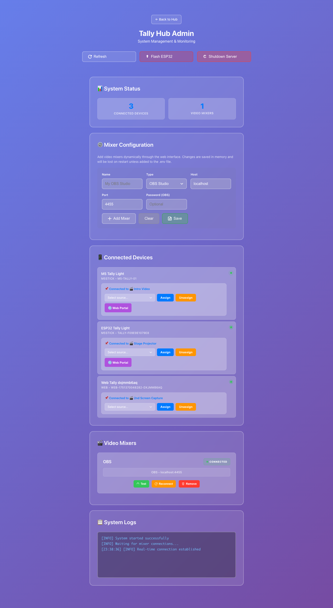

# Admin Panel

The Tally Hub admin panel is a modern, web-based interface for managing your tally light system. Featuring a beautiful gradient design and real-time updates, it provides comprehensive control over all aspects of your tally system.

## 🎨 **Interface Overview**

### Modern Design
- **Gradient Theme**: Beautiful purple gradient matching the Tally Hub brand
- **Responsive Layout**: Works perfectly on desktop, tablet, and mobile devices
- **Real-time Updates**: Live status updates without page refreshes
- **Material Design**: Follows modern design principles for intuitive operation

### Key Sections
1. **Dashboard Header**: System status and quick actions
2. **Video Mixers**: Manage video mixer connections
3. **Video Sources**: View available sources from connected mixers
4. **Tally Devices**: Monitor and manage connected devices
5. **Device Assignments**: Assign sources to specific devices

## 🔌 **Video Mixer Management**

### Adding Video Mixers

The admin panel supports multiple video mixer types:

=== "OBS Studio"
    1. Click **"Add Video Mixer"**
    2. Select **"OBS Studio"** from the dropdown
    3. Enter connection details:
       - **Host**: Usually `localhost` or `127.0.0.1`
       - **Port**: Default is `4455`
       - **Password**: If you set one in OBS WebSocket settings
    4. Click **"Test Connection"** to verify
    5. Click **"Save"** to add the mixer

=== "vMix"
    1. Click **"Add Video Mixer"**
    2. Select **"vMix"** from the dropdown
    3. Enter connection details:
       - **Host**: Usually `localhost` or `127.0.0.1`
       - **Port**: Default is `8088`
    4. Click **"Test Connection"** to verify
    5. Click **"Save"** to add the mixer

### Mixer Status Indicators

| Status | Indicator | Meaning |
|--------|-----------|---------|
| Connected | 🟢 **Connected** | Mixer is connected and responding |
| Disconnected | 🔴 **Disconnected** | Mixer is not reachable |
| Error | ⚠️ **Error** | Connection error with details |
| Connecting | 🟡 **Connecting** | Attempting to connect |

### Mixer Actions
- **🔄 Reconnect**: Force reconnection to mixer
- **⚙️ Settings**: Edit mixer configuration
- **🗑️ Remove**: Remove mixer from system
- **📊 Status**: View detailed connection status

## 📱 **Device Management**

### Device Types

The admin panel displays different types of tally devices:

#### Hardware Devices
- **ESP32-1732S019**: Compact devices with built-in displays
- **M5Stick C Plus**: Premium devices with high-quality screens
- **Custom Hardware**: Devices using the open UDP protocol

#### Software Devices  
- **Web Browser**: Smartphones, tablets, or computers as virtual tallies
- **API Clients**: Custom applications using the REST API

### Device Information

For each connected device, the admin panel shows:

- **Device Name**: Human-readable name for easy identification
- **Device Type**: Hardware model or software type
- **IP Address**: Network location (for hardware devices)
- **Connection Status**: Online/offline status with last seen time
- **Assignment**: Currently assigned video source
- **Tally State**: Current tally status (program/preview/idle)

### Device Actions

#### Assignment Management
1. **Assign Source**: Click "Assign" next to any device
2. **Select Source**: Choose from available video sources
3. **Confirm**: Assignment takes effect immediately
4. **Unassign**: Click "Unassign" to remove source assignment

#### Device Controls
- **🌐 Web Portal**: Open device's web interface (for ESP32/M5Stick)
- **📊 Details**: View detailed device information
- **🔄 Restart**: Send restart command to device
- **🗑️ Remove**: Remove device from system

## 📺 **Video Source Management**

### Source Discovery
- **Automatic Detection**: Sources are automatically discovered from connected mixers
- **Real-time Updates**: Source list updates when mixer configuration changes
- **Source Types**: Scenes, inputs, cameras, and other video sources

### Source Information
- **Source Name**: Name as defined in the video mixer
- **Source ID**: Unique identifier used for assignments
- **Mixer**: Which video mixer provides this source
- **Status**: Current state (program/preview/idle)
- **Assigned Devices**: Number of devices assigned to this source

## 🔔 **Notifications & Alerts**

### Real-time Notifications
The admin panel provides several types of notifications:

#### Toast Notifications
- **Device Connections**: When devices connect or disconnect
- **Assignment Changes**: When source assignments are modified
- **Mixer Status**: When video mixer connections change
- **System Events**: Important system status updates

#### Browser Notifications
- **Critical Alerts**: Mixer disconnections and system errors
- **Permission Required**: Browser must allow notifications
- **Desktop Integration**: Notifications appear even when tab is not active

### Notification Types

| Type | Icon | Purpose |
|------|------|---------|
| Success | ✅ | Successful operations |
| Warning | ⚠️ | Non-critical issues |
| Error | ❌ | Critical problems |
| Info | ℹ️ | General information |

## ⚙️ **System Settings**

### Network Configuration
- **Server Port**: Change the web server port (default: 3000)
- **UDP Port**: Configure UDP port for device communication (default: 7411)
- **Network Interface**: Select specific network interface

### Device Settings
- **Auto-assignment**: Automatically assign new devices to available sources
- **Device Timeout**: How long to wait before marking devices as offline
- **Wake-up Signals**: Enable/disable device wake-up on server start

### Security Settings
- **Admin Password**: Set password protection for admin panel
- **API Authentication**: Enable API key authentication
- **HTTPS**: Configure SSL certificates for secure connections

## 📊 **Monitoring & Diagnostics**

### Real-time Dashboard
- **Active Devices**: Number of connected devices
- **Data Transfer**: Network traffic statistics
- **Uptime**: Server uptime and stability metrics
- **Performance**: CPU and memory usage

### Device Health Monitoring
- **Connection Quality**: Signal strength and latency
- **Battery Status**: Battery level for wireless devices
- **Error Rates**: Communication error statistics
- **Response Times**: Device response latency

### System Logs
- **Event Log**: Real-time system events and activities
- **Error Log**: Detailed error messages and stack traces
- **Audit Log**: User actions and configuration changes
- **Debug Log**: Detailed technical information for troubleshooting

## 📱 **Mobile Interface**

### Responsive Design
The admin panel is fully optimized for mobile devices:

- **Touch-friendly**: Large buttons and touch targets
- **Swipe Navigation**: Intuitive gesture-based navigation
- **Optimized Layout**: Stacked interface for narrow screens
- **Fast Loading**: Minimal data usage for mobile connections

### Mobile-specific Features
- **Pull to Refresh**: Refresh device status with pull gesture
- **Haptic Feedback**: Vibration feedback for actions (on supported devices)
- **Offline Mode**: Basic functionality when internet is unavailable
- **Dark Mode**: Automatic dark theme based on system settings

## 🔧 **Advanced Features**

### Bulk Operations
- **Multi-select**: Select multiple devices for batch operations
- **Bulk Assignment**: Assign multiple devices to sources simultaneously
- **Batch Configuration**: Apply settings to multiple devices at once
- **Export/Import**: Backup and restore device configurations

### Custom Integrations
- **Webhook Support**: Send notifications to external systems
- **API Integration**: Full REST API for custom applications
- **Plugin System**: Extend functionality with custom plugins
- **Custom Themes**: Modify appearance with CSS customizations

### Performance Optimization
- **Caching**: Intelligent caching for faster response times
- **Compression**: Data compression for reduced bandwidth usage
- **Lazy Loading**: Load content as needed for better performance
- **Background Sync**: Sync data in background for seamless operation

---

!!! tip "Pro Tips"
    - Use keyboard shortcuts: `Ctrl+R` to refresh, `Ctrl+F` to search devices
    - Bookmark the admin panel URL for quick access
    - Enable browser notifications for real-time alerts
    - Use mobile interface for on-the-go monitoring

[Getting Started →](getting-started/index.md){ .md-button .md-button--primary }
[Troubleshooting →](troubleshooting.md){ .md-button }
