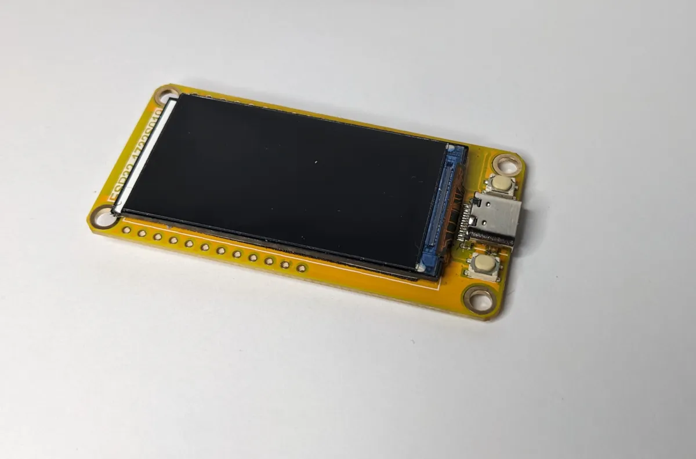

# Features

Tally Hub delivers professional-grade tally light functionality with modern web technologies and an intuitive interface designed for broadcast professionals.

## 🚀 **Core Features**

### Real-time Tally Updates
- **Sub-100ms latency** for critical live production timing
- **WebSocket connections** for instant browser-based tallies
- **UDP protocol** for hardware devices with minimal overhead
- **Automatic reconnection** and fault tolerance
- **Visual and audio feedback** options

### Device Management
- **Auto-discovery** of ESP32 and M5Stick devices
- **Web-based configuration** with drag-and-drop source assignment
- **Device health monitoring** with real-time connection status
- **Firmware flashing** directly from the admin panel
- **Wake-up system** for automatic device recovery

### Professional Interface
- **Modern gradient-based design** inspired by broadcast equipment
- **Real-time dashboard** with live device status
- **Responsive layout** that works on any screen size
- **Toast notifications** for immediate feedback
- **Error handling** with clear troubleshooting guidance

## 🎥 **Video Mixer Support**

-   :material-video:{ .lg .middle } **OBS Studio Integration**

    ---

    **Program/Preview tally** with scene changes
    
    **Recording status** indication
    
    **Streaming status** monitoring
    
    **WebSocket connection** for reliable communication
    
    **Auto-discovery** of scenes and sources

-   :material-television:{ .lg .middle } **vMix Professional**

    ---

    **Full tally matrix** support for all inputs
    
    **Preview/Program** state detection
    
    **Recording/Streaming** status
    
    **TCP connection** with automatic retry
    
    **Multi-format** input support

-   :material-power-plug:{ .lg .middle } **Extensible Support**

    ---

    **ATEM switchers** (coming soon)
    
    **Tricaster** integration (planned)
    
    **Custom mixers** via REST API
    
    **Open protocol** for any system

## 📱 **Device Support**

-   { .device-image } **ESP32-1732S019**

    ---

     **Professional Grade Hardware**
    
    **Built-in 1.9" color display** with excellent visibility
    
    **WiFi connectivity** with auto-reconnection
    
    **USB-C power** for reliable operation
    
    **Compact design** perfect for camera mounting
    
    **~$15 cost** making it extremely cost-effective

-   { .device-image } **M5Stick C Plus**

    ---

     **Premium Option**
    
    **High-quality 1.14" TFT display** with superior brightness
    
    **Built-in battery (135mAh)** for wireless operation
    
    **Professional housing** suitable for broadcast environments
    
    **Multiple mounting options** with accessories
    
    **~$25 cost** for premium features

-   :material-web:{ .lg .middle } **Web-based Tallies**

    ---

     **Universal Compatibility**
    
    **Any smartphone or tablet** becomes a tally light
    
    **No app installation** required - just visit a URL
    
    **Full-screen display** with customizable colors
    
    **Perfect for testing** before hardware investment
    
    **Completely free** for unlimited devices

## ⚡ **Technical Specifications**

| Specification | Details |
|---------------|---------|
| **Latency** | < 100ms end-to-end |
| **Capacity** | Unlimited devices (tested with 50+) |
| **Network** | Standard WiFi infrastructure |
| **Power** | 5V USB for hardware devices |
| **Protocols** | WebSocket, UDP, HTTP, OBS WebSocket, vMix TCP |
| **Compatibility** | Windows 10+, macOS 10.14+, Linux |
| **Browsers** | Chrome, Firefox, Safari, Edge |

## 🔧 **Advanced Features**

### Intelligent Device Management
- **Automatic wake-up system** broadcasts to sleeping devices
- **Persistent device storage** with IP address caching
- **Graceful reconnection** handling for network interruptions
- **Device health monitoring** with uptime tracking

### Source Assignment System
- **Drag-and-drop interface** for intuitive configuration
- **Persistent assignments** saved across server restarts
- **Bulk assignment tools** for large installations
- **Visual feedback** during configuration changes

### Professional Monitoring
- **Real-time status dashboard** with comprehensive device health
- **Connection history** and uptime tracking
- **Error logging** with detailed diagnostics
- **Performance metrics** for system optimization

### API Integration
- **RESTful API** for third-party system integration
- **WebSocket events** for real-time applications
- **JSON configuration** for automation scripts
- **Custom protocol support** for proprietary systems

## 🛠️ **Installation & Setup**

### One-Click Installation
- **Automated installer scripts** for Windows and macOS
- **Dependency checking** with automatic installation
- **Configuration wizard** for first-time setup
- **Update notifications** for new releases

### Browser-based Firmware Flashing
- **Web Serial API** support for direct ESP32 flashing
- **No additional software** required beyond a web browser
- **Progress monitoring** with detailed feedback
- **Automatic device detection** and configuration

### Development Features
- **Hot reload** during development
- **TypeScript codebase** for type safety and reliability
- **ESLint integration** for code quality
- **Comprehensive unit testing** framework

## 🔒 **Security & Reliability**

### Network Security
- **Local network operation** - no internet connectivity required
- **Optional authentication** for admin access control
- **HTTPS support** for secure connections
- **CORS protection** against unauthorized access

### Production Reliability
- **Fault tolerance** with automatic device reconnection
- **Graceful degradation** when devices go offline
- **Error recovery** with comprehensive logging
- **Backup configuration** system
- **Memory leak protection** with automatic cleanup

---

## 📊 **Comparison Matrix**

| Feature | Tally Hub | Commercial Solutions | DIY Solutions |
|---------|-----------|---------------------|---------------|
| **Cost per Device** |  $15-30 | $200-500+ | $10-20 |
| **Setup Time** |  < 30 minutes | Hours/Days | Days/Weeks |
| **Web Interface** |  Modern & Responsive | Legacy/Basic | None |
| **Open Source** |  Fully Open | Proprietary | Varies |
| **Professional Support** |  Community | Paid Support | DIY |
| **Customization** |  Complete Freedom | Limited | Complete |
| **User Experience** |  Professional Grade | Professional | Basic |
| **Documentation** |  Comprehensive | Varies | Minimal |

## 🎬 **Perfect for Any Production**

Whether you're running a **live streaming studio**, **corporate video production**, **educational environment**, **house of worship**, or **broadcast facility**, Tally Hub scales to meet your needs with professional reliability at a fraction of traditional costs.

---

**Ready to transform your production workflow?**  
**[Get started with Tally Hub](getting-started/index.md)** and experience professional tally lights that don't break the budget.
