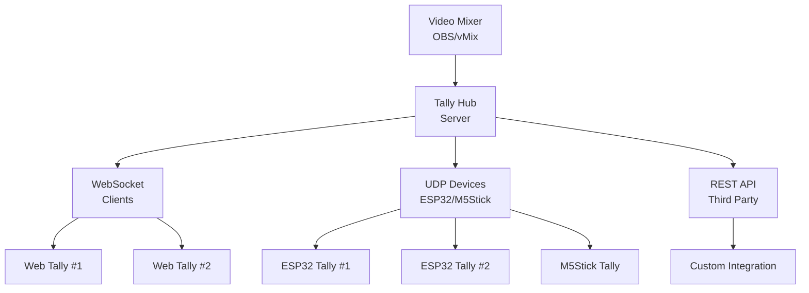

# Professional Tally Light System


**Tally Hub** is a modern, professional tally light system designed for video production environments. Built with TypeScript and featuring a beautiful web-based admin panel, Tally Hub provides reliable tally light control for professional video mixers including OBS Studio and vMix.

## 🎯 **Why Tally Hub?**

Tally Hub bridges the gap between expensive commercial tally systems and DIY solutions, offering:

- **Professional Grade**: Enterprise-level reliability with real-time tally updates
- **Cost Effective**: Use affordable ESP32/M5Stick hardware (~$15-30 per device)
- **Modern Interface**: Beautiful gradient-based admin panel with real-time monitoring
- **Flexible Deployment**: Run on any computer or server with Node.js
- **Open Source**: Fully customizable and community-driven


## ✨ **Key Features**

### 🚀 **Professional Performance**
- **Real-time Updates**: Sub-100ms tally state changes
- **Automatic Recovery**: Device wake-up and reconnection system
- **Enterprise Monitoring**: Comprehensive device status and health monitoring
- **Recording Status**: Visual indication of recording/streaming states

### 🔧 **Easy Setup**
- **Web-based Configuration**: No complex software installations
- **One-click Firmware Flashing**: Browser-based ESP32 firmware installation
- **Auto-discovery**: Devices automatically connect to the hub
- **Assignment Management**: Drag-and-drop source assignment

### 🎨 **Modern Design**
- **Beautiful Interface**: Gradient-based UI inspired by modern design trends
- **Responsive Layout**: Works perfectly on desktop, tablet, and mobile
- **Dark/Light Themes**: Adaptive interface for any lighting condition
- **Real-time Notifications**: Toast notifications and browser alerts

### 🔌 **Video Mixer Support**

| Mixer | Status | Features |
|-------|--------|----------|
| **OBS Studio** | ✅ Full Support | Program/Preview/Recording/Streaming |
| **vMix** | ✅ Full Support | Program/Preview/Recording/Streaming |
| **ATEM** | 🔄 Coming Soon | Program/Preview states |
| **Custom** | ✅ API Support | Full customization via REST API |

### 📱 **Device Support**

| Device Type | Cost | Features |
|-------------|------|----------|
| **ESP32-1732S019** | ~$15 | Built-in display, WiFi, compact design |
| **M5Stick C Plus** | ~$25 | Premium display, battery, professional housing |
| **Web Browser** | Free | Any smartphone/tablet as virtual tally |
| **Custom Hardware** | Varies | Build your own with our open protocol |

## 🏗️ **Architecture**

Tally Hub uses a modern hub-and-spoke architecture:



**Benefits of this approach:**

- **Centralized Control**: Single point of configuration and monitoring
- **Scalable**: Support for unlimited tally devices
- **Reliable**: Hub manages connections and handles device failures
- **Flexible**: Mix and match different device types
- **Professional**: Enterprise-grade monitoring and management

## 🚀 **Quick Start**

Get your Tally Hub system running in minutes:

=== "Windows"

    ```batch
    # Download and run the startup script
    Start Tally Hub.bat
    ```

=== "macOS/Linux"

    ```bash
    # Make executable and run
    chmod +x "Start Tally Hub.command"
    ./Start\ Tally\ Hub.command
    ```

=== "Manual Installation"

    ```bash
    # Clone the repository
    git clone https://github.com/tallyhubpro/Tallyhub.git
    cd Tallyhub
    
    # Install dependencies
    npm install
    
    # Start the server
    npm run dev
    ```

Then visit **http://localhost:3000/admin.html** to access the admin panel!

## 📊 **System Requirements**

### Server Requirements
- **Node.js** 16.x or later
- **Operating System**: Windows 10+, macOS 10.14+, or Linux
- **Memory**: 512MB RAM minimum
- **Network**: Local network access to video mixer

### Device Requirements
- **ESP32** or **M5Stick C Plus** hardware
- **WiFi Connection** to same network as Tally Hub server
- **Power Supply**: USB cable or battery pack

## 🎬 **Perfect for Professional Productions**

Tally Hub is designed for real production environments:

### **Live Streaming Studios**
- Multi-camera livestreams with OBS Studio
- Real-time audience engagement with multiple operators
- Recording status indication for post-production workflows

### **Corporate Video Production**
- Professional interviews and presentations
- Multi-camera corporate events
- Training video production with multiple angles

### **Educational Environments**
- Lecture capture systems
- Distance learning setups
- Student media production labs

### **Houses of Worship**
- Live service streaming
- Multi-camera worship environments
- Volunteer-friendly operation

### **Broadcast Facilities**
- Professional studio environments
- News production workflows
- Live event coverage

## 🤝 **Community & Support**

Join our growing community of video production professionals:

- **[GitHub Issues](https://github.com/tallyhubpro/Tallyhub/issues)**: Report bugs and request features
- **[Discussions](https://github.com/tallyhubpro/Tallyhub/discussions)**: Ask questions and share setups
- **[Wiki](https://github.com/tallyhubpro/Tallyhub/wiki)**: Community-contributed guides and tips

## 📈 **What's Next?**

1. **[Download](download.md)** the latest release
2. **[Follow the Setup Guide](getting-started/index.md)** for your first installation
3. **[Flash ESP32 Firmware](getting-started/firmware-flashing.md)** for hardware devices
4. **[Configure Your Video Mixer](mixers/supported-mixers.md)** connection
5. **[Join the Community](https://github.com/tallyhubpro/Tallyhub/discussions)** and share your setup!

---

<div class="grid cards" markdown>

-   :material-rocket-launch:{ .lg .middle } **Get Started**

    ---

    Jump right in with our quick start guide and have your first tally light working in minutes.

    [:octicons-arrow-right-24: Quick Start](getting-started/index.md)

-   :material-memory:{ .lg .middle } **Hardware Setup**

    ---

    Learn about supported devices and get your ESP32 or M5Stick configured.

    [:octicons-arrow-right-24: Hardware Guide](hardware/supported-devices.md)

-   :material-video:{ .lg .middle } **Video Mixers**

    ---

    Connect your favorite video mixer - OBS Studio, vMix, and more.

    [:octicons-arrow-right-24: Mixer Setup](mixers/supported-mixers.md)

-   :material-cog:{ .lg .middle } **Admin Panel**

    ---

    Explore the powerful web-based admin interface for monitoring and control.

    [:octicons-arrow-right-24: Admin Guide](admin-panel.md)

</div>

!!! tip "Professional Tip"
    Start with web-based tallies using smartphones or tablets to test your setup before investing in hardware devices. This lets you validate your configuration and understand the system before building physical tally lights.

---

*Made with ❤️ by the Tally Hub community*
